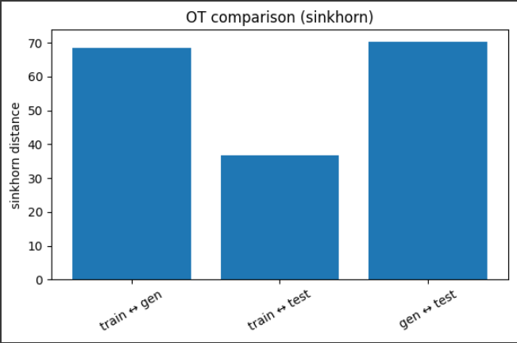

# Project Submission — Two‑Phase OT for Diffusion on MNIST (NEW Version)

## 0) Overview & Phases

- **Phase A — Passive OT Evaluation (per your PDF):** Train a diffusion model; embed train/test/generated images with a compact encoder; compute **regularized OT (Sinkhorn)** in feature space; run **precision/recall/overfitting** sensitivity tests; compare with **FID**.
- **Phase B — Active OT Loss:** Train with `loss = old + OT_WEIGHT * OT(generated, train)` using **GeomLoss**, and log `(total, old, ot)`; checkpoints let you analyze **OT vs epoch**.

## 1) Main result:

We can notice that when the model trained with OT loss, the results improved by more than 10%.

See the entire notebook results in the .ipynb files that in the folder.
# 2) Data Loading & Preparation

### `embed`
- **Purpose:** Embed images/batches into **128‑D features** using `SimpleMNISTFeatureNet`.
- **Inputs:**
  - `loader_or_tensor`: DataLoader or tensor `[B,1,H,W]`.
  - `normalize`: If `True`, L2‑normalizes each feature vector.
  - `no_grad`: If `True`, disables autograd to save memory.
- **Outputs:** Tensor `[N,128]` (if DataLoader) or `[B,128]`.
- **Notes:** Shared feature space for OT/FID.

### `_subsample`
- **Purpose:** Randomly pick k rows from a 2D tensor to bound OT cost/memory.
- **Inputs:** `Z`, `k`.
- **Outputs:** Subsampled tensor.

### `_normalize_pair`
- **Purpose:** L2‑normalize two feature batches for scale‑invariant OT.
- **Inputs:** `A`, `B`.
- **Outputs:** `A_norm`, `B_norm`.

### `sinkhorn_distance`
- **Purpose:** Compute **Sinkhorn OT distance/divergence** between two feature sets via GeomLoss.
- **Inputs:**
  - `feat_a`, `feat_b`: `[N,D]` / `[M,D]` L2‑normalized embeddings from the encoder.
  - `blur` (ε): Entropic smoothing; stabilizes gradients (higher → smoother).
  - `p`: Ground cost exponent (2 → L2²).
  - `scaling`: Multiscale acceleration factor (speed vs accuracy).
  - `debias`: If `True`, returns Sinkhorn **divergence** (debiased OT).
  - `backend`: `auto`/`tensorized`/`keops`.
- **Outputs:** Scalar OT value (differentiable).

### `compute_loss`
- **Purpose:** Compute the **OT‑augmented training loss**: `total = old_loss + OT_WEIGHT * OT_loss`.
- **Inputs:**
  - `model`: UNet used by the diffusion objective.
  - `diffusion`: GaussianDiffusion wrapper for forward/reverse processes.
  - `x0`: Real MNIST batch `[B,1,H,W]` used for score targets and feature extraction.
  - `device`: Target device (`cuda`/`cpu`).
  - `ot_weight`: Scalar that balances `OT_loss` against the base loss.
  - `return_components`: If `True`, returns `(total, old, ot)` for logging.
- **Outputs:** `(total_loss, old_loss, ot_loss)` or a scalar `total_loss`.
- **Notes:** OT compares encoder features of `x0` and on‑the‑fly generated samples.

### `compute_val_loss`
- **Purpose:** Evaluate the **OT‑aware** objective on the validation set.
- **Inputs:**
  - `val_loader`: DataLoader for validation images.
  - `device`: Target device.
  - `max_batches`: Optional cap to shorten validation.
- **Outputs:** Mean validation loss (and/or its components).

### `s`
- **Purpose:** Helper used in training/evaluation.
- **Inputs:** See function signature in the notebook.
- **Outputs:** As implemented.

### `_extract_epoch`
- **Purpose:** Parse epoch number from checkpoint path.
- **Inputs:** `path`.
- **Outputs:** `int` or `None`.

### `_find_latest_ckpt`
- **Purpose:** Locate the most recent checkpoint in a directory.
- **Inputs:** `ckpt_dir`.
- **Outputs:** Path or `None`.

### `_sample_batch`
- **Purpose:** Generate samples from the diffusion model (optionally from a checkpoint).
- **Inputs:**
  - `num_samples` / `N`: Total images to generate.
  - `batch_size` / `batch`: Per‑call sampler batch size.
  - `sample_steps`: Reverse‑diffusion steps (quality vs speed).
  - `ckpt_path`/`epoch` (if present): Load specific weights before sampling.
- **Outputs:** Tensor `[N,1,H,W]` or DataLoader of samples.

### `generate_samples`
- **Purpose:** Generate samples from the diffusion model (optionally from a checkpoint).
- **Inputs:**
  - `num_samples` / `N`: Total images to generate.
  - `batch_size` / `batch`: Per‑call sampler batch size.
  - `sample_steps`: Reverse‑diffusion steps (quality vs speed).
  - `ckpt_path`/`epoch` (if present): Load specific weights before sampling.
- **Outputs:** Tensor `[N,1,H,W]` or DataLoader of samples.

### `to_cpu_list`
- **Purpose:** Ensure a Python list of CPU tensors for aggregation.
- **Inputs:** tensor or list.
- **Outputs:** list of tensors.

### `_extract_logits_generic`
- **Purpose:** Helper used in training/evaluation.
- **Inputs:** See function signature in the notebook.
- **Outputs:** As implemented.

### `predict_labels_from_model`
- **Purpose:** Helper used in training/evaluation.
- **Inputs:** See function signature in the notebook.
- **Outputs:** As implemented.

### `collect_images_from_loader`
- **Purpose:** Helper used in training/evaluation.
- **Inputs:** See function signature in the notebook.
- **Outputs:** As implemented.

### `img_corrupt_precision`
- **Purpose:** Helper used in training/evaluation.
- **Inputs:** See function signature in the notebook.
- **Outputs:** As implemented.

### `img_corrupt_recall`
- **Purpose:** Helper used in training/evaluation.
- **Inputs:** See function signature in the notebook.
- **Outputs:** As implemented.

### `img_overfit_mix`
- **Purpose:** Helper used in training/evaluation.
- **Inputs:** See function signature in the notebook.
- **Outputs:** As implemented.

### `img_corrupt_overfit_gen_to_train`
- **Purpose:** Helper used in training/evaluation.
- **Inputs:** See function signature in the notebook.
- **Outputs:** As implemented.

### `img_corrupt_overfit_gen_to_test`
- **Purpose:** Helper used in training/evaluation.
- **Inputs:** See function signature in the notebook.
- **Outputs:** As implemented.

### `img_corrupt_overfit_train_to_test`
- **Purpose:** Helper used in training/evaluation.
- **Inputs:** See function signature in the notebook.
- **Outputs:** As implemented.

### `normalize01`
- **Purpose:** Helper used in training/evaluation.
- **Inputs:** See function signature in the notebook.
- **Outputs:** As implemented.

### `show_grid`
- **Purpose:** Helper used in training/evaluation.
- **Inputs:** See function signature in the notebook.
- **Outputs:** As implemented.

### `_l2norm`
- **Purpose:** Helper used in training/evaluation.
- **Inputs:** See function signature in the notebook.
- **Outputs:** As implemented.

### `_min_cdist`
- **Purpose:** Helper used in training/evaluation.
- **Inputs:** See function signature in the notebook.
- **Outputs:** As implemented.

### `overfit_test_affinity`
- **Purpose:** Helper used in training/evaluation.
- **Inputs:** See function signature in the notebook.
- **Outputs:** As implemented.

### `overfit_train_affinity`
- **Purpose:** Helper used in training/evaluation.
- **Inputs:** See function signature in the notebook.
- **Outputs:** As implemented.

### `split_data_deterministic`
- **Purpose:** Deterministically split a tensor along axis‑0 for reproducible A/B subsets.
- **Inputs:** `tensor`, `frac`, `seed`.
- **Outputs:** `(part_a, part_b)`.

### `calc_sensitivity_sweep`
- **Purpose:** Compute **Sinkhorn OT distance/divergence** between two feature sets via GeomLoss.
- **Inputs:**
  - `feat_a`, `feat_b`: `[N,D]` / `[M,D]` L2‑normalized embeddings from the encoder.
  - `blur` (ε): Entropic smoothing; stabilizes gradients (higher → smoother).
  - `p`: Ground cost exponent (2 → L2²).
  - `scaling`: Multiscale acceleration factor (speed vs accuracy).
  - `debias`: If `True`, returns Sinkhorn **divergence** (debiased OT).
  - `backend`: `auto`/`tensorized`/`keops`.
- **Outputs:** Scalar OT value (differentiable).

### `_find_all_ckpts`
- **Purpose:** List all `(epoch, path)` pairs for sweep plots.
- **Inputs:** `ckpt_dir`.
- **Outputs:** list of pairs.

### `_sample_batch`
- **Purpose:** Generate samples from the diffusion model (optionally from a checkpoint).
- **Inputs:**
  - `num_samples` / `N`: Total images to generate.
  - `batch_size` / `batch`: Per‑call sampler batch size.
  - `sample_steps`: Reverse‑diffusion steps (quality vs speed).
  - `ckpt_path`/`epoch` (if present): Load specific weights before sampling.
- **Outputs:** Tensor `[N,1,H,W]` or DataLoader of samples.

### `_generate_samples`
- **Purpose:** Generate samples from the diffusion model (optionally from a checkpoint).
- **Inputs:**
  - `num_samples` / `N`: Total images to generate.
  - `batch_size` / `batch`: Per‑call sampler batch size.
  - `sample_steps`: Reverse‑diffusion steps (quality vs speed).
  - `ckpt_path`/`epoch` (if present): Load specific weights before sampling.
- **Outputs:** Tensor `[N,1,H,W]` or DataLoader of samples.

### `_epoch_key`
- **Purpose:** Sorting key function returning epoch integer.
- **Inputs:** `path`.
- **Outputs:** int.

# 3) Encoder & Embeddings

### `__init__`
- **Purpose:** Helper used in training/evaluation.
- **Inputs:** See function signature in the notebook.
- **Outputs:** As implemented.

### `forward`
- **Purpose:** Helper used in training/evaluation.
- **Inputs:** See function signature in the notebook.
- **Outputs:** As implemented.

# 4) OT Core (GeomLoss) & Loss Wiring

### `to_float`
- **Purpose:** Convert tensors/lists to CPU `float32` for metrics/plots.
- **Inputs:** tensor/list.
- **Outputs:** tensor/list.

# 6) Training Loop & Checkpointing

### `compute_psnr`
- **Purpose:** Compute **PSNR** (assuming inputs in `[-1,1]`).
- **Inputs:** `x` (prediction), `y` (target), `data_range`.
- **Outputs:** Scalar dB value.

### `visualize_reconstructions`
- **Purpose:** Helper used in training/evaluation.
- **Inputs:** See function signature in the notebook.
- **Outputs:** As implemented.

### `_to_01`
- **Purpose:** Map images from `[-1,1]` to `[0,1]`.
- **Inputs:** `x`.
- **Outputs:** Rescaled tensor.

### `_preprocess_for_inception`
- **Purpose:** Resize/normalize images to Inception input for FID.
- **Inputs:** `x`.
- **Outputs:** Preprocessed tensor/features.

### `_extract_feature_tensor`
- **Purpose:** Helper used in training/evaluation.
- **Inputs:** See function signature in the notebook.
- **Outputs:** As implemented.

### `fid_features`
- **Purpose:** Compute **FID** between two sets (wrapper + core formula).
- **Inputs:** Means/covariances or tensors (with internal batching/preprocess).
- **Outputs:** Scalar FID value.

### `_cov`
- **Purpose:** Helper used in training/evaluation.
- **Inputs:** See function signature in the notebook.
- **Outputs:** As implemented.

### `_trace_sqrt_product`
- **Purpose:** Helper used in training/evaluation.
- **Inputs:** See function signature in the notebook.
- **Outputs:** As implemented.

### `frechet_distance`
- **Purpose:** Compute **FID** between two sets (wrapper + core formula).
- **Inputs:** Means/covariances or tensors (with internal batching/preprocess).
- **Outputs:** Scalar FID value.

### `fid_between_tensors`
- **Purpose:** Compute **FID** between two sets (wrapper + core formula).
- **Inputs:** Means/covariances or tensors (with internal batching/preprocess).
- **Outputs:** Scalar FID value.

### `_cap_pair`
- **Purpose:** Truncate two sets to the same `n` for fair FID/OT.
- **Inputs:** `A`, `B`, `n`.
- **Outputs:** `A'`, `B'`.

### `__init__`
- **Purpose:** Helper used in training/evaluation.
- **Inputs:** See function signature in the notebook.
- **Outputs:** As implemented.

### `forward`
- **Purpose:** Helper used in training/evaluation.
- **Inputs:** See function signature in the notebook.
- **Outputs:** As implemented.

# 9) Miscellaneous Utilities

### `extract_epoch_number`
- **Purpose:** Extract integer epoch from a filename/path.
- **Inputs:** string/Path.
- **Outputs:** epoch or `None`.

### `build_model_and_diffusion`
- **Purpose:** Construct **UNet** and **GaussianDiffusion** with configured image size, timesteps, and channels.
- **Inputs:**
  - `image_size`: 28 or 32 (MNIST).
  - `timesteps`: Training diffusion steps (e.g., ~1000).
  - `dim`, `dim_mults`: UNet base width and stage multipliers.
  - `channels`: 1 for MNIST.
- **Outputs:** `(model, diffusion)`.

### `show_generated`
- **Purpose:** Plot an `N×N` grid of generated digits.
- **Inputs:** `tensor`, `grid_n`.
- **Outputs:** Figure/axes.

# 5) How to Run

1. Colab + GPU; install `denoising-diffusion-pytorch torchvision wandb geomloss==0.2.6` (optional `pykeops`).
2. Data loaders (MNIST) → Encoder → OT core (`compute_loss`) → Build model → Train → Sample → Evaluate (OT/FID/sweeps).
3. Logs show `loss`, `old`, `ot`; keep `OT_WEIGHT`, `BLUR`, and timesteps consistent for fair comparisons.
